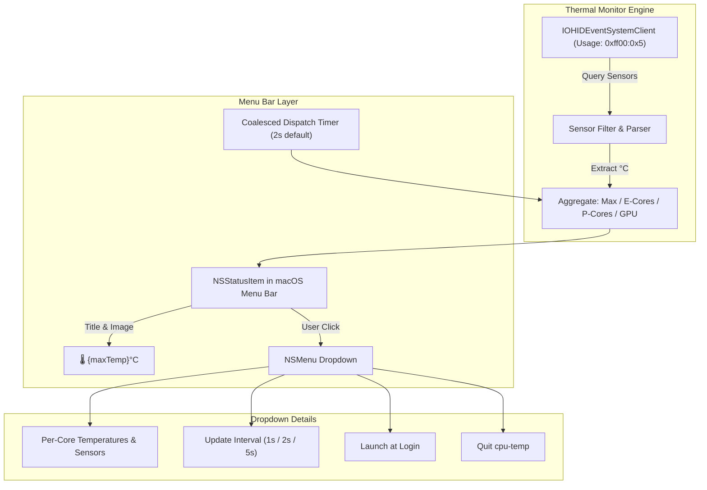

# cpu-temp: Step-by-Step Implementation Plan

## 1. Project Overview & Objectives
**cpu-temp** is a native, ultra-lightweight macOS menu bar utility designed specifically for Apple Silicon (MacBook Air). It displays the real-time CPU/SoC temperature in Celsius (`°C`) alongside a compact status icon directly in the menu bar.

### Core Goals
- **Real-time Monitoring**: Display the highest active CPU core / SoC temperature in the menu bar (e.g. `🌡️ 48°C`).
- **Zero Root Privileges**: Access Apple Silicon thermal sensors without requiring `sudo` or the resource-heavy `powermetrics` daemon.
- **Battery-Friendly (Fanless Optimization)**: Keep CPU utilization under 0.1% and memory footprint under 15 MB.
- **Sleep-Aware**: Automatically halt sensor polling when the display or system sleeps.
- **Self-Contained**: Build as a standalone `.app` bundle with zero external dependencies.

---

## 2. Technical Architecture



---

## 3. Step-by-Step Execution Plan

### Step 1: Project Scaffolding & App Bundle Structure
- Create directory structure:
  ```text
  cpu-temp/
  ├── build.sh
  ├── Info.plist
  └── Sources/
      └── cpu-temp/
          ├── main.swift
          ├── ThermalReader.swift
          ├── StatusBarController.swift
          └── AppState.swift
  ```
- Configure `Info.plist` with `LSUIElement = true` (ensures the app runs purely as a menu bar agent without showing in the Dock or Cmd+Tab switcher).

---

### Step 2: Implement Apple Silicon Thermal Reader (`ThermalReader.swift`)
- Bind to private `IOKit` / `IOHIDEventSystemClient` APIs using dynamic linking (`dlopen` / `dlsym`) for maximum compatibility across macOS versions.
- Match HID sensors on:
  - **Usage Page**: `0xff00` (Apple Vendor Specific)
  - **Usage**: `0x5` (Temperature)
- Enumerate thermal services and extract:
  - `Product` / `Sensor` names (e.g., `SOC MTR Temp Sensor`, `pACC MTR Temp Sensor`, `eACC MTR Temp Sensor`).
  - Current temperature values (converted to °C).
- Compute:
  - Primary metric: **Max CPU Core Temp** (ideal for glancing at thermal load).
  - Secondary metrics: Average CPU temp, individual P/E core groups, and GPU die temps.

---

### Step 3: Implement Menu Bar Controller (`StatusBarController.swift`)
- Initialize `NSStatusBar.system.statusItem(withLength: NSStatusItem.variableLength)`.
- Configure status item button:
  - **Icon**: Use system SF Symbols (`thermometer.medium` / `thermometer.low` / `thermometer.high`).
  - **Text**: Monospace formatted string (e.g., `45°C`).
  - **Dynamic Styling**: Optional subtle color cue if temperature exceeds 80°C.
- Bind click action to display the interactive `NSMenu`.

---

### Step 4: Construct Dropdown Detail Menu & Controls
- Implement detailed breakdown in `NSMenu`:
  - **Header**: Active thermal throttling status / summary.
  - **Sensor List**:
    - Performance Cores (P-Cores)
    - Efficiency Cores (E-Cores)
    - GPU Cores / Apple Neural Engine
    - Battery / Trackpad thermals (if available)
  - **Settings Submenu**:
    - Refresh rate options: `1s`, `2s` (default), `5s`.
    - Temperature unit toggle (default: `°C`, optional: `°F`).
    - Toggle launch at login (`SMAppService.mainApp`).
  - **Quit Action**: Graceful exit (`NSApp.terminate`).

---

### Step 5: Power & Sleep Optimization
- Use a `DispatchSourceTimer` with low priority and coalescing tolerance to prevent CPU spikes.
- Register listeners on `NSWorkspace`:
  - `NSWorkspace.screensDidSleepNotification` &rarr; pause polling timer.
  - `NSWorkspace.screensDidWakeNotification` &rarr; resume polling timer.
  - `NSWorkspace.willSleepNotification` & `didWakeNotification` &rarr; system sleep handlers.

---

### Step 6: Compilation, Packaging & Installation
- Compile binary with Swift compiler targeting native `arm64-apple-macos`.
- Package into a proper macOS app bundle (`cpu-temp.app`):
  ```text
  cpu-temp.app/
  └── Contents/
      ├── Info.plist
      ├── MacOS/
      │   └── cpu-temp
      └── Resources/
  ```
- Provide an installation script to copy `cpu-temp.app` to `/Applications` or `~/Applications`.

---

### Step 7: Verification & Testing
- **Sensor Accuracy Verification**: Compare readouts against hardware sensors via terminal verification scripts.
- **Resource Benchmark**: Verify CPU usage stays below 0.1% in `Activity Monitor`.
- **UI Responsiveness**: Test menu bar rendering, light/dark mode changes, and menu interactivity.
- **Sleep/Wake Cycle Test**: Verify polling resumes smoothly after MacBook lid close/open.
